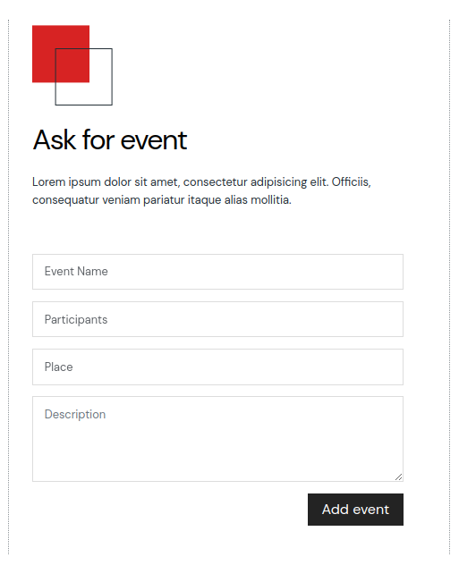

Пример колоквиумска задача 1
Completion requirements
Веб апликација за организирање на настани

Потребно е да креирате веб апликација за организирање на настани. Секој настан се карактеризира со име, датум и време на одржување на настанот, постер, корисник кој го креирал настанот, бендови кои настапуваат на настанот, информација дали настанот е на отворено или не. Секој бенд се карактеризира со име, име на држава од каде потекнува, година на формирање и број на одржани настапи. Бендовите може да настапуваат на повеќе настани. 

Креирајте ги соодветните модели кои ви се потребни за да овозможите правилно функционирање на системот. Потребно е да овозможите додавање на објекти преку Админ панелот, со забелешка дека бендовите на еден настан се додаваат во делот за настан.

Притоа, во рамки на Админ панелот потребно е да ги обезбедите следните функционалности:

Настани може да додаваат само супер-корисници, и тие автоматски се доделуваат на настанот
Настаните не може да се бришат и менуваат, освен од нивниот корисник-креатор, само ако нема ниту еден бенд поврзан со настанок
Настаните се прикажуваат со име и датум, а бендовите со име и држава на потекло
Апликацијата треба да има две страни, почетна (види слика 1) и страна за креирање на нов настан. На првата страна (index.html) се листаат сите настани кои ги креирал тековно најавениот корисник. За додавање на нов настан потребно е да се кликне на менито Ask for event на кој се отвара странта за додавање на нов настан. Бендовите се внесуваат одделени со запирка и при избор на копчето за додавање на настан потребно е истиот да се додаде, како и да се поврзат сите бендови со тој настан според нивното име.

