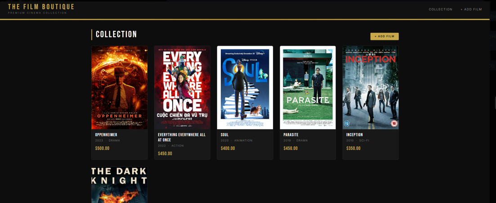
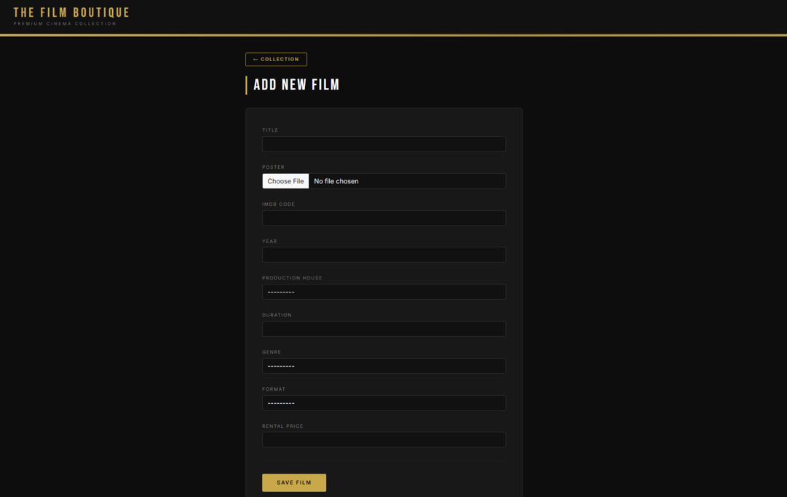

Креирајте Django апликација за менаџирање на онлајн филмотека. Секој филм се карактеризира со наслов, постер (слика), ИМДБ код, година на издавање, продукциска куќа, траење (во минути), жанр (акција, комедија, драма, хорор, sci-fi, документарец, анимација), формат (дигитален, Blu-ray, DVD) и цена на rental. За секоја продукциска куќа се знае: име, земја и град во кој се наоѓа, година на основање и официјален вебсајт. Потребно е да овозможите додавање на објекти преку Админ панелот. Со користење на Bootstrap рамката креирајте 2 темплејти за приказ на информациите и додавање нов филм: /index/ – приказ на сите филмови во филмотеката (постер, наслов, цена) во grid layout, слично на првата слика /movies/add/ – форма за додавање на нов филм во филмотеката; по успешно зачувување корисникот се пренасочува на /index/

